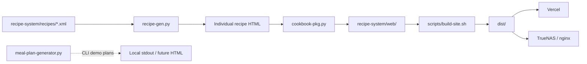
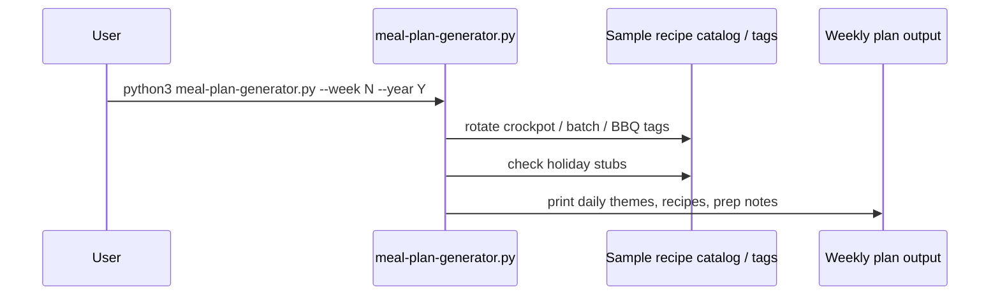

# Recipe Collection

Standalone recipe book viewable in any web browser. Each recipe is stored as XML; Python scripts generate searchable static HTML for deployment.

Favorite crockpot and easy meal-prep recipes include source credits. Meal planning supports weekly / 52-week plans with weekend batch/BBQ cooking and holiday stubs.


## Architecture

XML recipe sources are transformed by Python generators into a static site, then copied to `dist/` for Vercel or TrueNAS.



## Sequence diagrams

### Static site build (Vercel / local)

```mermaid
sequenceDiagram
  participant Dev as Developer / Vercel
  participant NPM as npm run build
  participant Gen as recipe-gen.py
  participant Box as cookbook-pkg.py
  participant Dist as dist/
  participant Host as Vercel or TrueNAS

  Dev->>NPM: trigger build
  NPM->>Gen: XML → recipe HTML (if lxml available)
  NPM->>Box: assemble recipe-box.html
  NPM->>Dist: copy recipe-system/web → dist
  Dist->>Host: serve static files (/ → recipe-box.html)
```

### Meal-plan generation



## Favorite Recipes (with Credit)

New and updated favorites focused on crockpot, easy prep, chicken, and meal-prep friendly meals that support weekend large batch/BBQ cooks for weekday lunches:

- **Crockpot Baked Ziti** — [Build Your Bite](https://buildyourbite.com/easy-crockpot-baked-ziti/) (updated with credit)
- **Slow Cooker Asian Sesame Chicken** — [Together as Family](https://togetherasfamily.com/slow-cooker-asian-sesame-chicken/)
- **Filipino Chicken Adobo (Crockpot Version)** — [MelanieCooks.com](https://www.melaniecooks.com/filipino-chicken-adobo/14493/)
- **3-Ingredient Crock Pot Pulled Chicken** — [Clean Food Crush](https://cleanfoodcrush.com/3-ingredient-crock-pot-pulled-chicken-clean-eating/) (with BBQ twist option)

Additional related recipes can be added from the source sites (e.g., Simply Quinoa garlic butter quinoa, Chelsea's Messy Apron Mexican quinoa tacos, Super Healthy Kids Instant Pot chicken & rice, Homemade Food Junkie).

All recipes include `meal-prep`, `crockpot`, `weekend-batch`, or `bbq-friendly` tags where appropriate.

## Meal Planning with FluffySpoon

FluffySpoon now supports generating meal plans optimized for your lifestyle:

- **Weekday focus**: Crockpot dump-and-go or easy meals (Asian Sesame Chicken, Adobo, Ziti, Pulled Chicken)
- **Weekend large BBQ / Batch Cook**: Big cook on Saturday/Sunday (e.g., 3-Ingredient Pulled Chicken with optional grill finish for smoky BBQ flavor, or large Ziti/Adobo batch). Supports meal prep for 4-5 lunches during the week.
- **52-Week + Holidays**: Use or extend `recipe-system/scripts/meal-plan-generator.py` to create full year plans. Includes stub for holiday overrides (4th of July BBQ, Thanksgiving, Christmas, etc.). Rotate recipes by tags and customize for family preferences.

### Quick Start for Meal Plans
```bash
cd recipe-system/scripts
python3 meal-plan-generator.py --week 28 --year 2026
```

Example output includes daily themes, specific recipe suggestions, meal prep notes, and holiday callouts. Extend the script with full calendar integration, more recipes from XML catalog, and output to HTML/printable format for your 52-week vision.

**Future enhancements**: Browser-based planner in recipe-box.html (JS generator), full holiday calendar, shopping list export, and preference filters (crockpot-only weeks, BBQ weekends, etc.).

## Deploy to Vercel

1. Import this repository in [Vercel](https://vercel.com).
2. Use the default settings (Vercel reads `vercel.json`):
   - **Build command:** `npm run build`
   - **Output directory:** `recipe-system/web`
3. Deploy. The site serves `recipe-box.html` at `/` with security headers applied.

To add or change recipes, edit XML files under `recipe-system/recipes/`, commit, and redeploy. The build step regenerates all HTML pages.

## Local development

```bash
# Generate static site
npm run build

# Preview locally
cd recipe-system/web && python3 -m http.server 8080
# Open http://localhost:8080/recipe-box.html
```

### Create recipes locally (optional)

A Flask form can write new XML files on your machine only. It is **disabled by default** and not suitable for Vercel (read-only filesystem).

```bash
cp .env.example .env
# Edit .env: set ENABLE_RECIPE_CREATE=true and FLASK_SECRET_KEY

pip install -r recipe-system/scripts/requirements.txt
cd recipe-system/scripts
python3 recipe-web-generator.py --serve
```

After creating recipes, run `npm run build` from the repo root and refresh the static site.

## Project layout

| Path | Purpose |
|------|---------|
| `recipe-system/recipes/` | Recipe XML source files (new ones auto-included on build) |
| `recipe-system/scripts/recipe-gen.py` | XML → individual HTML pages (XSLT) |
| `recipe-system/scripts/cookbook-pkg.py` | Builds searchable `recipe-box.html` |
| `recipe-system/scripts/recipe-web-generator.py` | Local recipe creation UI (dev only) |
| `recipe-system/scripts/meal-plan-generator.py` | **NEW** Weekly / 52-week meal plan demo generator |
| `recipe-system/web/` | Generated static site (Vercel output) |

## Security

See [SECURITY.md](SECURITY.md) for deployment model, Flask controls, and XSS mitigations.

## Roadmap

- **Recipe import** — bulk import from external formats (next planned feature)
- **Enhanced Meal Planner** — Full JS generator in web UI, 52-week calendar view, holiday specials, shopping lists, and preference-based rotation
- Add more recipes from linked sites (quinoa sides, Instant Pot meals, Mexican tacos, etc.)

## Vercel troubleshooting

If the deployment shows **404 NOT_FOUND**:

1. **Root Directory** in Vercel project settings must be **`.`** (repository root), not `recipe-system`, unless you intentionally use the nested `recipe-system/vercel.json`.
2. **Output Directory** should be left blank in the dashboard so `vercel.json` controls it (`dist` after build).
3. Confirm the latest **Production** deployment succeeded (build logs should show `Static site ready in dist`).
4. Redeploy after merging changes to `main`.
